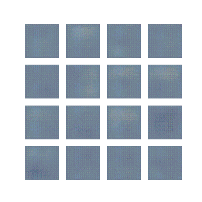

# Generated Image Prediction - Deep Learning Midterm

This project was developed for the **Deep Learning Midterm Exam**. It explores **Image Generation** using **Generative Adversarial Networks (GANs)** and **Image Classification** to distinguish between Real images and Generated (Fake) images.

## 📌 Project Overview

The project consists of two main objectives:
1.  **Image Generation**: Constructing a GAN architecture to generate synthetic images (i got **Whales**) from noise.
2.  **Detection/Classification**: Building a classification model to detect whether an image is real or AI-generated.

## 📂 File Structure

Here is a brief overview of the files in this repository:

- **`2702217522_imageGeneration.ipynb`**
  The main notebook for the **Image Generation** process. It includes:
  - Data preprocessing.
  - Generator & Discriminator architectures (GAN).
  - Training loop for generating images.
  - Visual evaluation of the generated outputs.

- **`2702217522_classification.ipynb`**
  The notebook for **Classification (Real vs. Fake)**. It includes:
  - Dataset preparation (combining real and generated images).
  - CNN model training to detect fake images.
  - Model accuracy evaluation.

- **`whale_generator_model_*.h5`**
  Saved model weights (checkpoints) from training:
  - `whale_generator_model_500epochs.h5`: Model weights after 500 epochs.
  - `whale_generator_model_1000epochs.h5`: Model weights after 1000 epochs.

- **`outputVisuals500epochs.gif`**
  A visualization of the GAN training progress, showing how the quality of generated images improved from the initial epoch up to epoch 500.

- **`generated_fake_images/`**
  A directory containing sample output images generated by the model.

## 📊 Results

Below is an example of the generation progress during training:

The classification model is subsequently used to validate the realism of these generated images by attempting to distinguish them from the original dataset.

---
**Course**: Deep Learning (Midterm)
